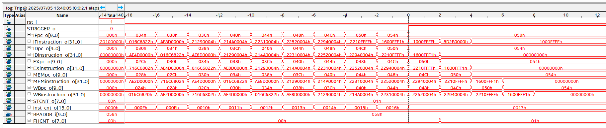
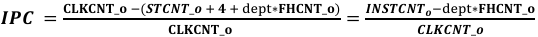
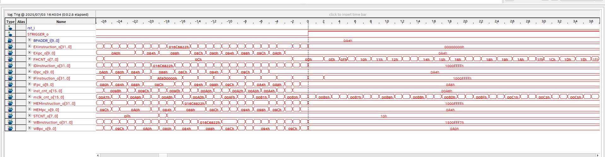
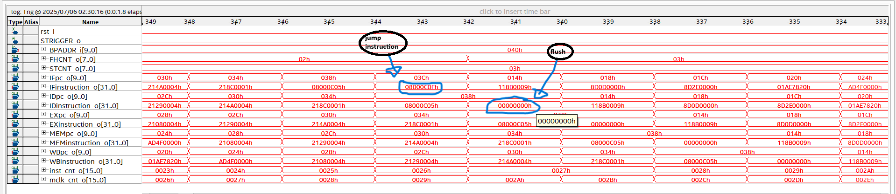

# Pipelined MIPS CPU (5-Stage, FPGA Verified)

## Overview

This project implements a 5-stage pipelined MIPS CPU with full data hazard detection, forwarding, and pipeline control mechanisms. Developed as part of an advanced undergraduate hardware design course, the project includes:

* IF, ID, EX, MEM, and WB stages implemented
* Load-use stall detection and forwarding logic
* Branch flushing and control flow handling in Decode (ID) stage
* Forwarding support into ID for branch operand comparison
* Runtime IPC (Instructions Per Cycle) measurement
* Breakpoint mechanism for controlled signal capture

### Verification Workflow

1. ModelSim simulation of handwritten assembly programs
2. Quartus synthesis and FPGA deployment
3. SignalTap validation — real-time inspection of instruction flow, stalls, and memory access

---

## Architecture Overview

High-level datapath with forwarding, hazard detection, and branch resolution in Decode stage.

---

## Forwarding and Data Hazard Resolution

To minimize pipeline stalls due to RAW (read-after-write) dependencies, the CPU includes a full forwarding unit.

* **EX-stage forwarding**: Forwarding paths are implemented from MEM and WB stages back to the EX stage to resolve ALU-to-ALU dependencies without stalling.
* **ID-stage forwarding**: For branch instructions resolved in Decode, the register values are forwarded from EX/MEM to support early comparison.
* **Hazard detection unit**: When forwarding is not possible (e.g., a `lw` followed by a dependent instruction), the pipeline inserts a stall.

This combination of forwarding and hazard detection ensures correct execution while maintaining high performance.

---

## Branch and Jump Handling

* Branch instructions (`beq`, `bne`) are resolved in the Decode (ID) stage
* Forwarding logic extends into ID to supply operands for branch comparison
* This reduces the branch penalty to a single delay slot
* When a branch is taken, the IF stage is flushed to discard the incorrect instruction

> This CPU implements a single delay slot control hazard model.

---

## SignalTap Verification

### 1. Pipeline Execution

Shows instruction flow through IF → ID → EX → MEM → WB over multiple cycles.
Captured near program end, triggered by breakpoint.

### 2. IPC Measurement

Since we handle wrong fetched instruction early in the pipeline, the depth =1.

Instruction count = 166, Clock count = 180, Flush/hazard count = 14
Computed IPC =(166-14×1)/180≈ 0.84.

### 3. Load-Use Hazard Stall

One-cycle stall inserted to handle a load-use data hazard.
Pipeline correctly delays dependent `add` instruction following a `lw`.

### 4. Branch Flush Verification

Control hazard: branch misprediction causes instruction flush.
Flush signal asserted; pipeline redirected correctly with no writeback corruption.

---

## Breakpoint Trigger (Hardware-Controlled)

All SignalTap captures were triggered using a hardware-configurable breakpoint mechanism:

* Breakpoint address selected via FPGA switches
* When `PC` matches this address, a `breakpoint_w` signal is asserted
* Used as SignalTap trigger to freeze execution at a specific instruction

**Benefits:**

* Accurate IPC measurement
* Clear snapshots of pipeline state
* Targeted capture of hazard and control behavior

---

## What I Learned

This project deepened my understanding of pipelined CPU architecture, control logic, and real-time FPGA debugging. Key learning outcomes:

- Built a complete 5-stage MIPS CPU in VHDL with forwarding and stalling
- Resolved data/control hazards using custom hazard detection logic
- Measured IPC and performance using real execution metrics on FPGA
- Integrated hardware breakpoints and used SignalTap for runtime validation
- Strengthened skills in simulation (ModelSim), synthesis (Quartus), and hardware testing

---

## Contact
<<<<<<< HEAD

For questions, feedback, or collaboration inquiries, feel free to reach out:

**Ahseen**  
 azazmehhus@example.com

=======
later
>>>>>>> 55e056e16cff0def6c1adccb4d7d08b81b8ee352
